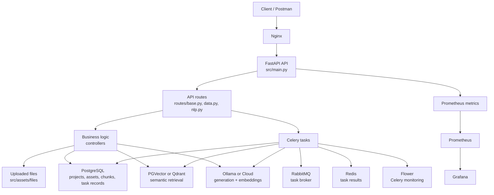
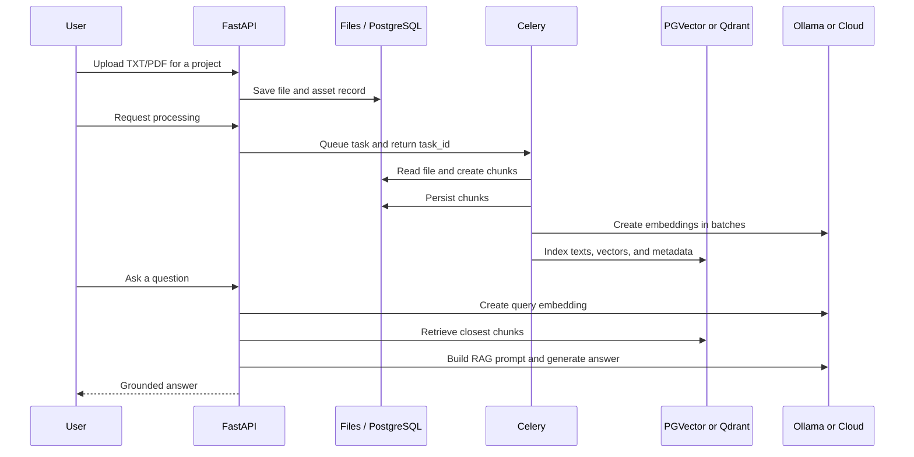
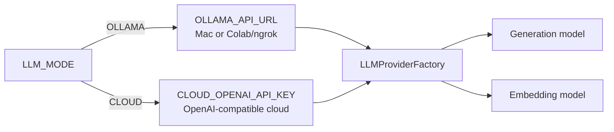

# RAG Document Intelligence

RAG Document Intelligence is a document-grounded Retrieval-Augmented Generation
(RAG) platform. It ingests TXT and PDF files, processes them into chunks,
indexes their embeddings, retrieves relevant context, and generates answers
with either Ollama or a cloud OpenAI-compatible provider.

This `main` branch is the complete, cumulative application. Each numbered
branch is a tutorial checkpoint that introduces one capability.

## Architecture



### Layers and responsibilities

```text
routes → controllers / Celery tasks → models / stores → external services
```

| Layer | Responsibility |
| --- | --- |
| `src/main.py` | Creates FastAPI and initializes PostgreSQL, the LLM clients, vector store, templates, and metrics. |
| `src/routes/` | Exposes versioned HTTP endpoints under `/api/v1` and returns API responses. |
| `src/controllers/` | Handles synchronous business rules: file validation, storage, chunking, prompt construction, and RAG orchestration. |
| `src/tasks/` | Handles long-running Celery work: document processing, indexing, workflows, and maintenance. |
| `src/models/` | Persists projects, assets, chunks, and task executions through asynchronous SQLAlchemy sessions. |
| `src/stores/llm/` | Provides one interface for Ollama/OpenAI-compatible APIs and Cohere. |
| `src/stores/vectordb/` | Provides one interface for PGVector and Qdrant. |
| `src/utils/` | Implements application metrics and task idempotency support. |
| `docker/` | Defines the multi-service deployment, monitoring, and local environment templates. |

At application startup, these shared dependencies are attached to `app` and
retrieved by routes through `request.app`:

| Dependency | Role |
| --- | --- |
| `app.db_client` | Creates asynchronous PostgreSQL sessions. |
| `app.generation_client` | Generates the final natural-language answer. |
| `app.embedding_client` | Converts documents and questions into vectors. |
| `app.vectordb_client` | Creates, fills, and searches PGVector or Qdrant collections. |
| `app.template_parser` | Loads RAG prompt templates for the configured language. |

### Communication flow: document to answer



#### 1. Upload and asset tracking

`DataController` validates the MIME type, size, and filename before writing the
file to `src/assets/files/<project_id>/`. PostgreSQL stores an asset record that
links the generated filename, file type, and file size to its project.

#### 2. Background document processing

Processing is queued rather than executed inside the HTTP request. The Celery
worker loads TXT/PDF content, splits it into chunks, preserves available
metadata, and persists `DataChunk` records. With `do_reset=1`, existing chunks
and their associated vectors can be cleared before processing again.

RabbitMQ transports task messages, Redis stores task state and results, and
Flower displays worker and task activity.

#### 3. Embedding and vector indexing

The embedding client creates vectors for chunk batches. A vector record keeps a
reference to the original chunk so the matching text can be recovered later.

| Backend | Role |
| --- | --- |
| `PGVECTOR` | Stores vectors in PostgreSQL alongside relational data. |
| `QDRANT` | Stores vectors in a dedicated vector-search database. |

`VECTOR_DB_BACKEND` selects the backend. Collection names include both the
project identifier and embedding dimension to avoid mixing incompatible vectors.

#### 4. RAG retrieval and answer generation

For a user question, the application creates a query embedding, retrieves the
nearest chunks, renders the language-specific RAG template, and sends the final
prompt to the generation model. The answer is therefore based on retrieved
project documents rather than only the model's general knowledge.

### LLM profile selection



Only `LLM_MODE` changes when switching environments. Ollama's default models
are `llama3.2` for generation and `nomic-embed-text` for embeddings. The same
provider contract works with local Ollama, an ngrok URL from Colab, or cloud.

### Infrastructure, observability, and safety

`docker/docker-compose.yml` orchestrates FastAPI, Nginx, PostgreSQL/PGVector,
Qdrant, RabbitMQ, Redis, Celery Worker, Celery Beat, Flower, Prometheus,
Grafana, and exporters. Alembic versions the PostgreSQL schema, including task
execution tables.

Prometheus collects HTTP metrics, Grafana visualizes them, and Flower monitors
Celery. Keep `.env`, `docker/env/.env.*`, `alembic.ini`, passwords, cloud keys,
and ngrok URLs out of Git. Stop a Colab/ngrok tunnel after testing because its
public URL exposes the Ollama endpoint.

## Capabilities

- FastAPI endpoints for uploading, processing, indexing, searching, and
  answering questions about documents.
- PostgreSQL persistence, Alembic migrations, and PGVector or Qdrant for
  semantic retrieval.
- Switchable LLM profiles: local Ollama, Ollama served from Google Colab through
  ngrok, or a cloud OpenAI-compatible service.
- Celery workers, RabbitMQ, Redis, scheduled maintenance, and Flower task
  monitoring.
- Docker deployment with Nginx, Prometheus, and Grafana.

## Quick Start: Local Development

### 1. Install dependencies

Use Python 3.10 or later, then create an isolated environment:

```bash
conda create -n rag-document-intelligence python=3.10
conda activate rag
cd src
pip install -r requirements.txt
```

### 2. Create local configuration

```bash
cp .env.example .env
```

`src/.env` is personal and ignored by Git. Store API keys, passwords, and an
ngrok URL only there. `src/.env.example` is the safe, versioned template.

### 3. Choose the LLM profile

For Ollama on the Mac:

```env
LLM_MODE="OLLAMA"
OLLAMA_API_URL="http://localhost:11434/v1"
```

For Colab, keep `LLM_MODE="OLLAMA"` and replace the URL with the HTTPS ngrok
address followed by `/v1`. For a cloud provider:

```env
LLM_MODE="CLOUD"
CLOUD_OPENAI_API_KEY="your-key-kept-only-in-.env"
```

See [the Ollama local and Colab guide](docs/OLLAMA_LOCAL_AND_COLAB.md) for
model downloads, notebook usage, and ngrok setup.

### 4. Start infrastructure

For PostgreSQL/PGVector, RabbitMQ, Redis, and the other services, create the
Docker environment files from their templates:

```bash
cd ../docker/env
cp .env.example.app .env.app
cp .env.example.postgres .env.postgres
cp .env.example.rabbitmq .env.rabbitmq
cp .env.example.redis .env.redis
cp .env.example.grafana .env.grafana
cp .env.example.postgres-exporter .env.postgres-exporter
```

Edit these local files so the RabbitMQ, Redis, Celery, and LLM values agree,
then start the stack:

```bash
cd ..
docker compose up --build -d
```

The Docker guide contains deployment, monitoring, and troubleshooting details:
[docker/README.md](docker/README.md).

### 5. Run database migrations

For a local development run, copy the Alembic template then apply migrations:

```bash
cd src/models/db_schemes/minirag
cp alembic.ini.example alembic.ini
# Set sqlalchemy.url in alembic.ini
alembic upgrade head
```

### 6. Start the API and workers

```bash
cd src
uvicorn main:app --reload --host 0.0.0.0 --port 8000
```

In separate terminals, start the task worker, scheduler, and Flower dashboard:

```bash
cd src
python -m celery -A celery_app worker --queues=default,file_processing,data_indexing --loglevel=info
python -m celery -A celery_app beat --loglevel=info
python -m celery -A celery_app flower --conf=flowerconfig.py
```

Useful local endpoints:

- API: `http://localhost:8000`
- API documentation: `http://localhost:8000/docs`
- Flower: `http://localhost:5555`
- Prometheus: `http://localhost:9090`
- Grafana: `http://localhost:3000`

## Configuration Principles

- Never commit real values in `.env`, `docker/env/.env.*`, or `alembic.ini`.
- Copy each `.env.example` file to its local counterpart before running a
  service.
- Change `LLM_MODE` rather than application code when switching Ollama and
  cloud LLM environments.
- Select `VECTOR_DB_BACKEND="PGVECTOR"` or `"QDRANT"` according to the desired
  vector backend.

## Tutorial Branch Roadmap

| Branch | Capability |
| --- | --- |
| `01-architecture` | Project architecture and configuration foundation |
| `02-fastapi-foundation` | First FastAPI endpoint |
| `03-configured-api-routes` | Versioned modular routes |
| `04-document-upload-foundation` | Document upload workflow |
| `05-document-processing` | TXT/PDF chunk processing |
| `06-mongodb-persistence` | Initial persistence tutorial checkpoint |
| `07-asset-tracking` | Uploaded-file asset tracking |
| `08-llm-provider-abstraction` | OpenAI and Cohere provider abstraction |
| `09-qdrant-vector-store` | Qdrant vector storage |
| `10-llm-answer-generation` | Retrieval and LLM answer generation |
| `11-rag-answer-generation-checkpoint` | RAG flow review checkpoint |
| `12-rag-template-and-route-fixes` | RAG prompt and route fixes |
| `13-postgresql-sqlalchemy-migration` | PostgreSQL, SQLAlchemy, and Alembic |
| `13b-ollama-local-and-colab` | Ollama local/Colab-ngrok and cloud switching |
| `14-pgvector-vector-store` | PGVector backend and asynchronous vector operations |
| `15-containerized-deployment-and-observability` | Docker deployment, Nginx, Prometheus, and Grafana |
| `16-background-document-processing` | Celery, RabbitMQ, and Redis processing queue |
| `17-celery-workflows-and-monitoring` | Celery workflows, Beat, Flower, and task tracking |

## Project Principles

- Configuration stays outside source code.
- Dependencies are pinned for reproducible environments.
- Each tutorial branch adds one focused capability; `main` combines them all.
