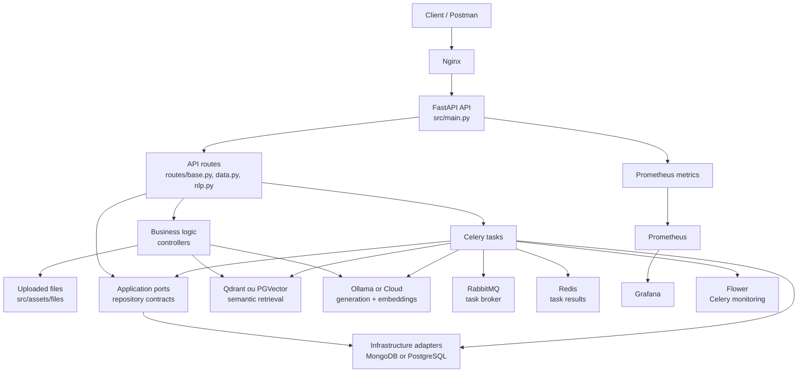
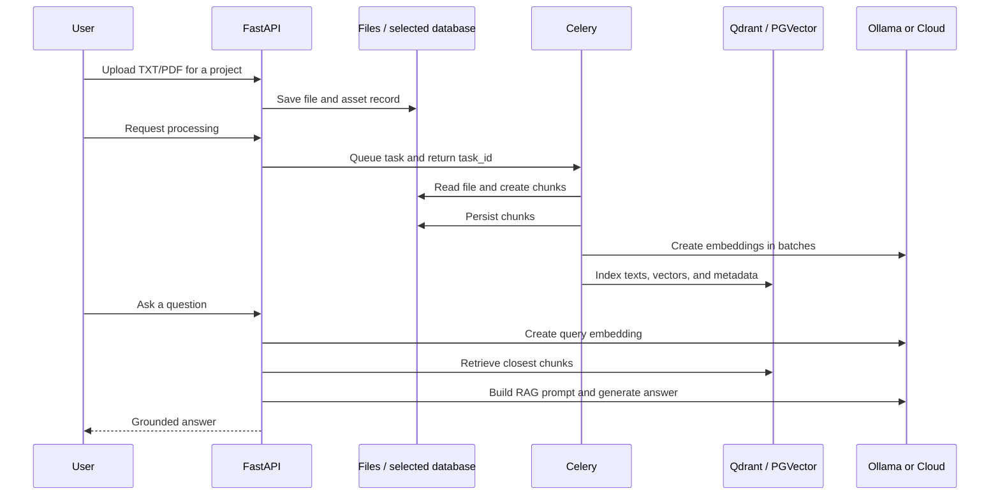
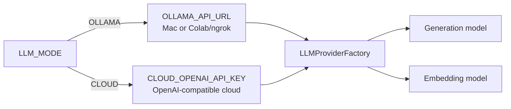

# RAG Document Intelligence

RAG Document Intelligence is a document-grounded Retrieval-Augmented Generation
(RAG) platform. It ingests TXT and PDF files, processes them into chunks,
indexes their embeddings, retrieves relevant context, and generates answers
with either Ollama or a cloud OpenAI-compatible provider.

Article technique : [Qdrant vs PGVector : construire un RAG interchangeable
avec Pydantic, SQLAlchemy et FastAPI](docs/articles/qdrant-vs-pgvector-rag.md).

## Branche `13c-mongodb-postgresql-switch`

Cette branche ajoute une persistance interchangeable entre MongoDB et
PostgreSQL, sans modifier les routes HTTP, les contrôleurs, les tâches Celery
ou le fonctionnement RAG. Le choix est effectué une seule fois au démarrage du
processus avec une variable de configuration :

```env
PERSISTENCE_BACKEND="mongodb"
# ou
PERSISTENCE_BACKEND="postgresql"
```

Après une modification de ce flag, il faut redémarrer **FastAPI, Celery Worker
et Celery Beat**. Un processus déjà lancé ne change jamais de base de données
pendant son exécution.

### Ce qui a été implémenté

- conservation du comportement MongoDB provenant du projet Mini-RAG ;
- ajout d'un adaptateur PostgreSQL asynchrone avec SQLAlchemy et `asyncpg` ;
- ajout des migrations Alembic pour les tables PostgreSQL ;
- séparation des contrats applicatifs et des détails techniques des bases ;
- division de la persistance en quatre petits repositories spécialisés ;
- normalisation des identifiants en `str` dans le domaine, qu'ils proviennent
  d'un `ObjectId` MongoDB ou d'un entier PostgreSQL ;
- persistance de l'idempotence Celery dans la base sélectionnée ;
- même contrainte d'unicité `(asset_project_id, asset_name)` dans les deux
  bases ;
- fermeture des connexions en cas d'arrêt normal ou d'échec d'initialisation ;
- suppression de l'ancienne couche monolithique `src/persistence/`.

Le stockage vectoriel possède désormais son propre switch indépendant. Qdrant
ou PGVector peuvent être associés à MongoDB comme à PostgreSQL. Aucun des deux
switches ne migre automatiquement les données vers le backend cible.

### Vue rapide du mécanisme

Au démarrage, la factory lit `PERSISTENCE_BACKEND`, crée un seul adaptateur et
expose exactement les mêmes repositories au reste de l'application :

```text
FastAPI routes and Celery tasks
             ↓
       ports applicatifs
        ↙                  ↘
 repositories Motor     repositories SQLAlchemy
```

Le seul `if` MongoDB/PostgreSQL se trouve dans la composition de
l'infrastructure. Les routes utilisent par exemple
`request.app.persistence.projects.get_or_create(...)` et ne connaissent ni
`ObjectId`, ni `AsyncSession`, ni SQLAlchemy.

### Où activer le switch

| Exécution | Fichier à modifier | Valeur |
| --- | --- | --- |
| Application lancée depuis `src/` | `src/.env` | `PERSISTENCE_BACKEND="mongodb"` ou `"postgresql"` |
| Stack Docker Compose | `docker/env/.env.app` | `PERSISTENCE_BACKEND="mongodb"` ou `"postgresql"` |

Ne placez pas le flag dans `alembic.ini`. Alembic sert uniquement à versionner
le schéma PostgreSQL ; le choix du backend appartient à la configuration de
l'application.

Le vector store est sélectionné séparément dans le même fichier :

```env
VECTOR_DB_BACKEND="QDRANT"
# ou
VECTOR_DB_BACKEND="PGVECTOR"
```

`VECTOR_DB_BACKEND` est l'unique sélecteur. Les URL, chemins et paramètres
PostgreSQL peuvent rester configurés en permanence : la factory ignore ceux du
backend non sélectionné. Il ne faut modifier ni la factory, ni `main.py`, ni
`celery_app.py`, ni l'entrypoint Docker pour changer de vector store.

Concrètement, modifier **une seule ligne** :

- lancement local : `src/.env` ;
- lancement Docker : `docker/env/.env.app`.

Puis redémarrer les processus afin qu'ils relisent cette valeur :

```bash
# Local : arrêter puis relancer ces commandes
cd src
uvicorn main:app --reload --host 0.0.0.0 --port 8000
python -m celery -A celery_app worker --queues=default,file_processing,data_indexing --loglevel=info

# Docker
cd docker
docker compose up -d --force-recreate fastapi celery-worker celery-beat
```

La sélection est centralisée dans
`src/stores/vectordb/VectorDBProviderFactory.py`. FastAPI et Celery appellent
simplement `create()` ; la factory lit elle-même `settings.VECTOR_DB_BACKEND`
et construit l'adaptateur approprié.

Les quatre combinaisons prises en charge sont :

| Persistance métier | Stockage vectoriel | Usage |
| --- | --- | --- |
| MongoDB | Qdrant | Mode historique Mini-RAG |
| MongoDB | PGVector | Documents MongoDB, embeddings PostgreSQL |
| PostgreSQL | Qdrant | Données relationnelles, embeddings Qdrant |
| PostgreSQL | PGVector | Toutes les données dans PostgreSQL, avec séparation logique |

## Architecture



### Couches et responsabilités

```text
routes / tasks → ports applicatifs ← adaptateurs d'infrastructure → bases
```

| Couche | Responsabilité |
| --- | --- |
| `src/main.py` | Composition de FastAPI et initialisation des dépendances partagées. |
| `src/routes/` | Endpoints HTTP versionnés sous `/api/v1`; aucune logique spécifique à une base. |
| `src/controllers/` | Validation des fichiers, découpage, construction du prompt et orchestration RAG. |
| `src/tasks/` | Traitements longs Celery : chunks, indexation, workflows et maintenance. |
| `src/domain/` | Records indépendants de toute base : `ProjectRecord`, `AssetRecord`, `ChunkRecord`, `TaskExecutionRecord`. |
| `src/application/ports/` | Interfaces minimales attendues par l'application. Cette couche ne dépend d'aucun driver de base. |
| `src/infrastructure/persistence/` | Adaptateurs Motor/SQLAlchemy et factory de sélection du backend. |
| `src/models/db_schemes/minirag/` | Modèles SQLAlchemy et historique des migrations Alembic PostgreSQL. |
| `src/stores/llm/` | Fournisseurs Ollama/OpenAI-compatible et Cohere. |
| `src/stores/vectordb/` | Contrat vectoriel et adaptateurs Qdrant/PGVector. |
| `src/utils/` | Métriques et service d'idempotence des tâches. |
| `docker/` | Services, réseau, volumes, observabilité et exemples de configuration. |

Arborescence spécifique au switch :

```text
src/
├── domain/
│   └── records.py                    # objets échangés par l'application
├── application/
│   └── ports/
│       └── persistence.py            # contrats des repositories
├── infrastructure/
│   └── persistence/
│       ├── factory.py                # sélection via PERSISTENCE_BACKEND
│       ├── mongodb.py                # implémentation Motor
│       └── postgresql.py             # implémentation SQLAlchemy async
└── models/db_schemes/minirag/
    ├── schemes/                      # modèles SQLAlchemy
    └── alembic/versions/             # migrations PostgreSQL
```

La règle de dépendance est la suivante : le domaine ne dépend d'aucune base,
les ports dépendent seulement du domaine, et les adaptateurs techniques
implémentent les ports. Ce découpage applique notamment :

- **SRP** : chaque repository gère une famille de données ;
- **ISP** : les consommateurs reçoivent une petite interface spécialisée ;
- **DIP** : l'idempotence, les routes et les tâches dépendent des contrats, pas
  de Motor ou SQLAlchemy ;
- **LSP** : les deux implémentations retournent les mêmes records et les mêmes
  types d'identifiants.

### Contrats de persistance

| Repository | Opérations principales | Données |
| --- | --- | --- |
| `projects` | `get_or_create` | Projets |
| `assets` | `create`, `get`, `list` | Fichiers uploadés et métadonnées |
| `chunks` | `insert_many`, `list`, `count`, `delete_by_project` | Segments de documents |
| `task_executions` | `create`, `find`, `update`, `cleanup` | Idempotence et statut Celery |

MongoDB conserve ses relations internes sous forme d'`ObjectId`. PostgreSQL
conserve ses clés sous forme d'entiers et ses métadonnées en `JSONB`. Ces types
restent privés aux adaptateurs : les couches supérieures voient toujours des
records avec des identifiants `str`.

| Caractéristique | MongoDB | PostgreSQL |
| --- | --- | --- |
| Driver | Motor asynchrone | SQLAlchemy async + `asyncpg` |
| Structure | Collections flexibles | Tables et contraintes explicites |
| Évolution du schéma | Indexes créés au démarrage | Migrations Alembic versionnées |
| Identifiant natif | `ObjectId` | `Integer` auto-incrémenté |
| Identifiant exposé au métier | `str` | `str` |
| Métadonnées | Document BSON | `JSONB` |

### Séquence de démarrage

1. `Settings` valide les variables exigées par le backend choisi.
2. `create_persistence(settings)` construit `MongoPersistence` ou
   `PostgresPersistence`.
3. L'adaptateur vérifie la connexion et crée les indexes MongoDB si nécessaire.
4. FastAPI expose l'agrégat via `app.persistence`.
5. Les routes et tâches sélectionnent seulement le repository utile.
6. À l'arrêt, la connexion Motor ou le moteur SQLAlchemy est fermé.

En Docker/PostgreSQL, l'entrypoint du conteneur FastAPI exécute auparavant
`alembic upgrade head` lorsque `RUN_DB_MIGRATIONS="true"`. Les workers ne
lancent pas Alembic, ce qui évite plusieurs migrations concurrentes.

Les dépendances partagées sont attachées à l'application FastAPI au démarrage
et récupérées dans les routes via `request.app` :

| Dépendance | Rôle |
| --- | --- |
| `app.persistence` | Opérations neutres pour les projets, assets, chunks et exécutions. |
| `app.generation_client` | Génération de la réponse en langage naturel. |
| `app.embedding_client` | Transformation des documents et questions en vecteurs. |
| `app.vectordb_client` | Création, alimentation et recherche avec Qdrant ou PGVector. |
| `app.template_parser` | Chargement des templates RAG selon la langue configurée. |

### Flux complet : du document à la réponse



#### 1. Upload and asset tracking

`DataController` validates the MIME type, size, and filename before writing the
file to `src/assets/files/<project_id>/`. The selected database stores an asset record that
links the generated filename, file type, and file size to its project.

#### 2. Background document processing

Processing is queued rather than executed inside the HTTP request. The Celery
worker loads TXT/PDF content, splits it into chunks, preserves available
metadata, and persists `DataChunk` records. With `do_reset=1`, existing chunks
and their associated vectors can be cleared before processing again.

RabbitMQ transports task messages, Redis stores task state and results, and
Flower displays worker and task activity.

#### 3. Embedding and vector indexing

The embedding client creates vectors for chunk batches. A vector record keeps a
reference to the original chunk so the matching text can be recovered later.

Qdrant ou PGVector stocke les vecteurs selon `VECTOR_DB_BACKEND`. Les noms de
collection contiennent l'identifiant du projet et la dimension des embeddings,
ce qui évite de mélanger des vecteurs incompatibles.

#### 4. RAG retrieval and answer generation

For a user question, the application creates a query embedding, retrieves the
nearest chunks, renders the language-specific RAG template, and sends the final
prompt to the generation model. The answer is therefore based on retrieved
project documents rather than only the model's general knowledge.

### LLM profile selection



Only `LLM_MODE` changes when switching environments. Ollama's default models
are `llama3.2` for generation and `nomic-embed-text` for embeddings. The same
provider contract works with local Ollama, an ngrok URL from Colab, or cloud.

### Infrastructure, observability, and safety

`docker/docker-compose.yml` orchestrates FastAPI, Nginx, MongoDB, PostgreSQL,
Qdrant, RabbitMQ, Redis, Celery Worker, Celery Beat, Flower, Prometheus,
Grafana, and exporters.

Prometheus collects HTTP metrics, Grafana visualizes them, and Flower monitors
Celery. Keep `.env`, `docker/env/.env.*`, passwords, cloud keys,
and ngrok URLs out of Git. Stop a Colab/ngrok tunnel after testing because its
public URL exposes the Ollama endpoint.

## Fonctionnalités

- endpoints FastAPI pour uploader, traiter, indexer et interroger les documents ;
- persistance MongoDB/PostgreSQL et vector store Qdrant/PGVector sélectionnables ;
- profils LLM interchangeables : Ollama local, Ollama Colab/ngrok ou cloud ;
- Celery, RabbitMQ, Redis, maintenance planifiée et supervision Flower ;
- déploiement Docker avec Nginx, Prometheus et Grafana.

## Installation et commandes

Toutes les commandes suivantes partent de la racine du dépôt
`RAGDocumentsIntelligence`, sauf indication contraire.

### Option A — application locale et infrastructure Docker

#### 1. Créer l'environnement Python

Utiliser Python 3.11 ou une version ultérieure :

```bash
conda create -n rag python=3.11 -y
conda activate rag
cd src
pip install -r requirements.txt
cp .env.example .env
cd ..
```

Le paquet `psycopg2-binary` est volontairement utilisé : il évite la
compilation locale de `psycopg2` et l'erreur `Failed to build psycopg2` en
l'absence de `pg_config`.

`src/.env` contient les secrets locaux et est ignoré par Git. Ne modifiez pas
`src/.env.example` avec de vraies clés ou de vrais mots de passe.

#### 2. Préparer Docker Compose

```bash
cd docker/env
cp .env.example.app .env.app
cp .env.example.postgres .env.postgres
cp .env.example.rabbitmq .env.rabbitmq
cp .env.example.redis .env.redis
cp .env.example.grafana .env.grafana
cp .env.example.postgres-exporter .env.postgres-exporter
cd ../..
```

Les mots de passe PostgreSQL, RabbitMQ et Redis doivent correspondre entre les
fichiers qui les utilisent.

#### 3. Démarrer les services techniques

```bash
cd docker
docker compose up -d mongodb pgvector qdrant rabbitmq redis
docker compose ps
cd ..
```

Depuis l'application exécutée sur la machine hôte, les adresses sont :

| Service | Hôte | Port |
| --- | --- | --- |
| MongoDB | `localhost` | `27007` |
| PostgreSQL | `localhost` | `5400` |
| Qdrant | `localhost` | `6333` |
| RabbitMQ | `localhost` | `5672` |
| Redis | `localhost` | `6379` |

#### 4A. Configurer MongoDB

Dans `src/.env` :

```env
PERSISTENCE_BACKEND="mongodb"
MONGODB_URL="mongodb://localhost:27007"
MONGODB_DATABASE="rag_document_intelligence"
```

MongoDB ne nécessite pas Alembic. Les collections et indexes nécessaires sont
créés par l'adaptateur lors du démarrage.

#### 4B. Configurer PostgreSQL

Dans `src/.env` :

```env
PERSISTENCE_BACKEND="postgresql"
POSTGRES_USERNAME="postgres"
POSTGRES_PASSWORD="postgres_password"
POSTGRES_HOST="localhost"
POSTGRES_PORT=5400
POSTGRES_MAIN_DATABASE="minirag"
```

Le mot de passe et le nom de la base doivent être identiques aux valeurs
`POSTGRES_PASSWORD` et `POSTGRES_DB` de
`docker/env/.env.postgres`.

Appliquer ensuite les migrations :

```bash
cd src/models/db_schemes/minirag
alembic -c alembic.ini.example upgrade head
alembic -c alembic.ini.example current
cd ../../../..
```

La sortie attendue de `current` est la révision marquée `(head)`. Il ne faut
pas coder un identifiant de révision précis dans la documentation ou les
scripts : la tête évolue avec les nouvelles migrations.

Commandes Alembic utiles :

```bash
cd src/models/db_schemes/minirag

# Afficher l'historique
alembic -c alembic.ini.example history

# Générer une migration après une modification des modèles SQLAlchemy
alembic -c alembic.ini.example revision --autogenerate -m "describe schema change"

# Relire la migration générée, puis l'appliquer
alembic -c alembic.ini.example upgrade head
```

Toujours relire une migration autogénérée avant de l'exécuter. Alembic ne doit
pas être lancé pour MongoDB seul. Il reste nécessaire avec
`VECTOR_DB_BACKEND="PGVECTOR"`, même si `PERSISTENCE_BACKEND="mongodb"`, car
la migration active l'extension PostgreSQL `vector`.

#### 4C. Choisir Qdrant ou PGVector

Qdrant partagé :

```env
VECTOR_DB_BACKEND="QDRANT"
VECTOR_DB_URL="http://localhost:6333"
VECTOR_DB_DISTANCE_METHOD="cosine"
```

PGVector :

```env
VECTOR_DB_BACKEND="PGVECTOR"
VECTOR_DB_DISTANCE_METHOD="cosine"
VECTOR_DB_PGVECTOR_INDEX_THRESHOLD=100
```

PGVector réutilise les variables `POSTGRES_*`. Elles sont donc obligatoires
même lorsque la persistance métier reste MongoDB. `VECTOR_DB_URL` et
`VECTOR_DB_PATH` ne sont pas utilisés en mode PGVector.

#### 5. Configurer le LLM

Ollama local :

```env
LLM_MODE="OLLAMA"
OLLAMA_API_URL="http://localhost:11434/v1"
OLLAMA_GENERATION_MODEL_ID="llama3.2"
OLLAMA_EMBEDDING_MODEL_ID="nomic-embed-text"
OLLAMA_EMBEDDING_MODEL_SIZE=768
```

Pour Colab, conserver `LLM_MODE="OLLAMA"` et utiliser l'URL HTTPS ngrok suivie
de `/v1`. Pour OpenAI ou un fournisseur compatible :

```env
LLM_MODE="CLOUD"
CLOUD_OPENAI_API_KEY="your-private-key"
CLOUD_OPENAI_API_URL=""
```

Voir [le guide Ollama local et Colab](docs/OLLAMA_LOCAL_AND_COLAB.md).

#### 6. Lancer l'application

Terminal FastAPI :

```bash
conda activate rag
cd src
uvicorn main:app --reload --host 0.0.0.0 --port 8000
```

Terminal Celery Worker :

```bash
conda activate rag
cd src
python -m celery -A celery_app worker --queues=default,file_processing,data_indexing --loglevel=info
```

Terminaux optionnels pour Beat et Flower :

```bash
cd src
python -m celery -A celery_app beat --loglevel=info
python -m celery -A celery_app flower --conf=flowerconfig.py
```

### Option B — stack Docker complète

Dans `docker/env/.env.app`, choisir le backend. Les noms des services Docker
sont utilisés comme hôtes :

```env
# Mode MongoDB
PERSISTENCE_BACKEND="mongodb"
MONGODB_URL="mongodb://mongodb:27017"
MONGODB_DATABASE="rag_document_intelligence"
```

ou :

```env
# Mode PostgreSQL
PERSISTENCE_BACKEND="postgresql"
POSTGRES_USERNAME="postgres"
POSTGRES_PASSWORD="postgres_password"
POSTGRES_HOST="pgvector"
POSTGRES_PORT=5432
POSTGRES_MAIN_DATABASE="minirag"
```

Puis lancer toute la stack :

```bash
cd docker
docker compose up --build -d
docker compose ps
docker compose logs --tail=100 fastapi
```

En mode PostgreSQL, le conteneur FastAPI applique automatiquement
`alembic upgrade head`. En mode MongoDB, cette étape est ignorée.

`VECTOR_DB_URL="http://qdrant:6333"` est important en Docker : l'API et les
workers utilisent ainsi le même serveur Qdrant. `VECTOR_DB_PATH` est réservé à
un lancement local dans un seul processus ; il ne doit pas servir à partager
une base embarquée entre plusieurs conteneurs.

Pour utiliser PGVector dans Docker :

```env
VECTOR_DB_BACKEND="PGVECTOR"
VECTOR_DB_DISTANCE_METHOD="cosine"
VECTOR_DB_PGVECTOR_INDEX_THRESHOLD=100
```

Lorsque PGVector est actif, l'entrypoint applique aussi les migrations si
`RUN_DB_MIGRATIONS="true"`, y compris avec une persistance métier MongoDB.

### Passer d'une base à l'autre

Le switch ne nécessite aucune modification du code :

1. arrêter les requêtes et tâches en cours ;
2. modifier `PERSISTENCE_BACKEND` dans le fichier `.env` utilisé ;
3. vérifier les variables de connexion du backend cible ;
4. appliquer `alembic upgrade head` avant un démarrage PostgreSQL local ;
5. redémarrer FastAPI et tous les processus Celery.

Après le redémarrage, `GET /api/v1/` affiche `persistence_backend` et
`vector_db_backend`. Cela permet de confirmer dans Postman que le nouveau flag
a bien été chargé avant de relancer l'indexation.

Pour une stack Docker déjà démarrée :

```bash
cd docker
docker compose up -d --build --force-recreate fastapi celery-worker celery-beat flower
docker compose logs --tail=100 fastapi celery-worker
```

Les données ne sont pas synchronisées entre MongoDB et PostgreSQL. Après un
switch, l'application lit uniquement les données déjà présentes dans la base
cible. Une migration de données est une opération séparée.

Le même principe s'applique aux vecteurs : passer de Qdrant à PGVector, ou
l'inverse, ne copie pas les embeddings. Après le redémarrage, relancer
**Index project chunks** avec `do_reset=1` pour construire la collection dans
le nouveau vector store.

### Vérifications et diagnostic

#### Scénario Postman recommandé

Importer la collection
`src/assets/rag-document-intelligence.postman_collection.json`. Les variables
de collection par défaut sont `api=http://127.0.0.1:8000` et `project_id=1`.

Exécuter les requêtes dans cet ordre :

1. **Health / API configuration** : doit répondre `200` avec le nom et la
   version de l'application.
2. **Upload document** : sélectionner un fichier TXT ou PDF dans
   `Body > form-data > file`. La réponse contient un `file_id` tel que
   `abc123_document.txt`.
3. **Queue document processing** : recopier exactement ce `file_id` dans le
   JSON de la requête. Un worker Celery doit être actif.
4. **Index project chunks** : lancer l'indexation après la fin du traitement.
5. **Get index information**, puis **Semantic search**.
6. **RAG answer** : nécessite aussi que le LLM configuré soit accessible.

Exemple pour la requête de traitement :

```json
{
  "file_id": "value-returned-by-upload.txt",
  "chunk_size": 500,
  "overlap_size": 50,
  "do_reset": 0
}
```

Pour valider réellement le switch, exécuter le scénario une première fois en
MongoDB, changer le flag, redémarrer API et workers, puis utiliser un autre
`project_id` pour le scénario PostgreSQL. Le endpoint de santé confirme que
l'API répond, tandis que les logs de démarrage indiquent immédiatement une
erreur si la base sélectionnée est indisponible.

```bash
# Vérifier l'API
curl http://localhost:8000/api/v1/

# Vérifier les conteneurs et leurs logs
cd docker
docker compose ps
docker compose logs --tail=100 mongodb
docker compose logs --tail=100 pgvector
docker compose logs --tail=100 fastapi

# Reconstruire l'image de l'application
docker build -f minirag/Dockerfile -t ragdocumentsintelligence:local ..
```

Contrôles de qualité depuis la racine du dépôt :

```bash
# Vérifier la cohérence des dépendances installées
pip check

# Compiler tous les modules Python sans démarrer les services
python -m compileall -q src

# Vérifier que le schéma PostgreSQL est à jour
cd src/models/db_schemes/minirag
alembic -c alembic.ini.example current
```

Endpoints utiles :

- API : `http://localhost:8000`
- Swagger/OpenAPI : `http://localhost:8000/docs`
- Flower : `http://localhost:5555`
- Qdrant : `http://localhost:6333/dashboard`
- Prometheus : `http://localhost:9090`
- Grafana : `http://localhost:3000`

Erreurs fréquentes :

- `Failed to build psycopg2` : réinstaller les dépendances actuelles qui
  utilisent `psycopg2-binary` ;
- `connection refused` : contrôler l'hôte/port et `docker compose ps` ;
- erreur Alembic : vérifier les variables PostgreSQL et lancer la commande
  depuis `src/models/db_schemes/minirag` ;
- données absentes après un switch : elles sont probablement dans l'autre
  backend ; le flag ne copie pas les données ;
- changement de flag sans effet : redémarrer FastAPI et tous les workers.

## Principes de configuration

- ne jamais commiter de vraies valeurs dans `.env` ou `docker/env/.env.*` ;
- copier les fichiers `.env.example` vers leurs fichiers locaux avant le
  démarrage ;
- changer `LLM_MODE`, et non le code, pour passer d'Ollama au cloud ;
- changer `PERSISTENCE_BACKEND`, et non le code, pour passer de MongoDB à
  PostgreSQL, puis redémarrer l'API et les workers ;
- choisir séparément `VECTOR_DB_BACKEND="QDRANT"` ou `"PGVECTOR"` ;
- relancer l'indexation après un changement de vector store.

## Tutorial Branch Roadmap

| Branch | Capability |
| --- | --- |
| `01-architecture` | Project architecture and configuration foundation |
| `02-fastapi-foundation` | First FastAPI endpoint |
| `03-configured-api-routes` | Versioned modular routes |
| `04-document-upload-foundation` | Document upload workflow |
| `05-document-processing` | TXT/PDF chunk processing |
| `06-mongodb-persistence` | Initial persistence tutorial checkpoint |
| `07-asset-tracking` | Uploaded-file asset tracking |
| `08-llm-provider-abstraction` | OpenAI and Cohere provider abstraction |
| `09-qdrant-vector-store` | Qdrant vector storage |
| `10-llm-answer-generation` | Retrieval and LLM answer generation |
| `11-rag-answer-generation-checkpoint` | RAG flow review checkpoint |
| `12-rag-template-and-route-fixes` | RAG prompt and route fixes |
| `13b-ollama-local-and-colab` | Ollama local/Colab-ngrok and cloud switching |
| `14-pgvector-vector-store` | PGVector backend and asynchronous vector operations |
| `15-containerized-deployment-and-observability` | Docker deployment, Nginx, Prometheus, and Grafana |
| `16-background-document-processing` | Celery, RabbitMQ, and Redis processing queue |
| `17-celery-workflows-and-monitoring` | Celery workflows, Beat, Flower, and task tracking |

## Project Principles

- Configuration stays outside source code.
- Dependencies are pinned for reproducible environments.
- Each tutorial branch adds one focused capability; `main` combines them all.
