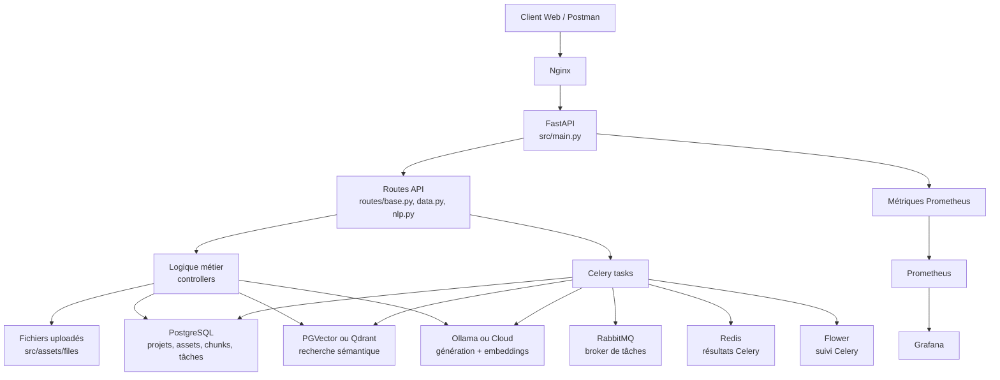
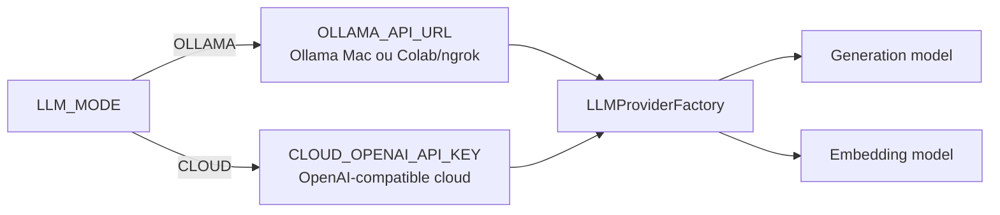
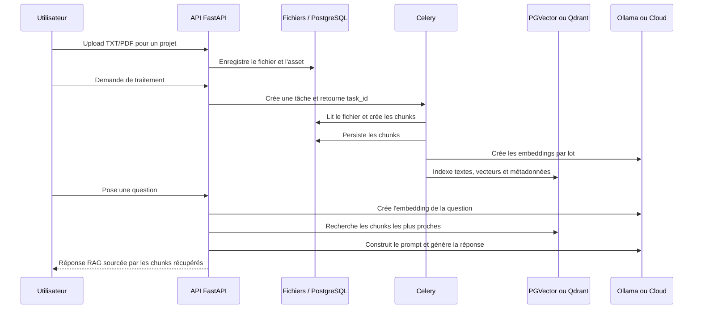

# Architecture détaillée de RAG Document Intelligence

Ce document décrit l’architecture de la branche `main`, qui regroupe toutes les
étapes du projet. Le système transforme des documents TXT/PDF en connaissances
recherchables, puis génère des réponses fondées sur les passages pertinents.

## 1. Vue d’ensemble



Le principe de séparation est le suivant :

```text
routes → controllers / tasks → models / stores → services externes
```

- Les **routes** reçoivent et valident les requêtes HTTP.
- Les **controllers** appliquent les règles métier synchrones.
- Les **tasks Celery** réalisent les traitements longs hors de la requête HTTP.
- Les **models** lisent et écrivent les données relationnelles.
- Les **stores** encapsulent les fournisseurs LLM et les bases vectorielles.

## 2. Rôle de chaque composant

| Composant | Rôle |
| --- | --- |
| `src/main.py` | Crée FastAPI, initialise PostgreSQL, le LLM, le vector store, les templates et les métriques. |
| `src/routes/` | Expose les routes versionnées sous `/api/v1`. |
| `src/controllers/` | Gère le stockage des fichiers, le découpage, la création des prompts et le RAG. |
| `src/models/` | Accède aux entités PostgreSQL : projets, assets, chunks et exécutions Celery. |
| `src/stores/llm/` | Uniformise OpenAI-compatible/Ollama et Cohere derrière une même interface. |
| `src/stores/vectordb/` | Permet de choisir PGVector ou Qdrant sans modifier les routes. |
| `src/tasks/` | Définit les tâches de traitement, d’indexation, de workflow et de maintenance. |
| `src/celery_app.py` | Configure Celery, RabbitMQ, Redis, les files et le scheduler Beat. |
| `src/utils/` | Regroupe les métriques et la gestion de l’idempotence des tâches. |
| `docker/` | Fournit le déploiement multi-services et les modèles de configuration locale. |

## 3. Démarrage de l’application

Au démarrage, `main.py` construit des dépendances partagées et les place dans
`app`. Les routes y accèdent ensuite via `request.app`.

| Dépendance | Utilité |
| --- | --- |
| `app.db_client` | Fabrique des sessions SQLAlchemy asynchrones vers PostgreSQL. |
| `app.generation_client` | Génère une réponse à partir du prompt RAG. |
| `app.embedding_client` | Transforme documents et questions en vecteurs. |
| `app.vectordb_client` | Crée, alimente et interroge le backend PGVector ou Qdrant. |
| `app.template_parser` | Charge les templates RAG selon `PRIMARY_LANG` et `DEFAULT_LANG`. |

Les métriques HTTP sont ajoutées comme middleware et exposées à Prometheus.

## 4. Configuration et profils LLM

La configuration est chargée depuis `src/.env`. Ce fichier reste local et ne
doit jamais être versionné ; `src/.env.example` documente les valeurs attendues.



Le changement de profil ne nécessite pas de modifier les routes ou les
controllers : seul `LLM_MODE` change.

- **Ollama local** : `OLLAMA_API_URL="http://localhost:11434/v1"`.
- **Ollama Colab** : URL ngrok HTTPS suivie de `/v1`.
- **Cloud** : clé dans `CLOUD_OPENAI_API_KEY` ; l’URL est optionnelle pour
  l’endpoint OpenAI par défaut.

Les modèles par défaut Ollama sont `llama3.2` pour la génération et
`nomic-embed-text` pour les embeddings.

## 5. Pipeline de document à réponse



### 5.1 Upload

Les routes de données délèguent à `DataController` :

1. validation du type MIME, de la taille et du nom de fichier ;
2. création/récupération du projet ;
3. écriture physique sous `src/assets/files/<project_id>/` ;
4. création d’un **asset** PostgreSQL qui relie le fichier au projet.

Un asset contient notamment le projet propriétaire, le nom généré du fichier,
son type et sa taille.

### 5.2 Traitement asynchrone

Le traitement peut être coûteux pour des PDF volumineux. La route crée donc une
tâche Celery et répond rapidement avec un `task_id`.

La tâche `file_processing` :

1. charge le fichier avec le loader TXT ou PDF adapté ;
2. découpe le contenu en chunks ;
3. conserve les métadonnées disponibles ;
4. crée des enregistrements `DataChunk` liés au projet et à l’asset ;
5. peut réinitialiser les chunks et vecteurs existants quand `do_reset=1`.

RabbitMQ transporte le message de tâche. Redis conserve son état et son
résultat. Flower permet de voir l’état des workers et des tâches.

### 5.3 Indexation vectorielle

Les chunks sont envoyés par lots au client d’embedding. Chaque vecteur conserve
un lien avec le chunk d’origine afin de retrouver le texte et ses métadonnées.

Deux backends sont disponibles :

| Backend | Rôle |
| --- | --- |
| `PGVECTOR` | Stocke les vecteurs dans PostgreSQL, près des données relationnelles. |
| `QDRANT` | Stocke les vecteurs dans une base dédiée à la recherche vectorielle. |

`VECTOR_DB_BACKEND` choisit le backend. Le nom de collection contient la
dimension d’embedding et l’identifiant du projet, ce qui évite de mélanger des
vecteurs produits par des modèles incompatibles.

### 5.4 Question et réponse RAG

Pour une question utilisateur :

1. le système crée l’embedding de la question ;
2. le vector store retourne les chunks les plus proches ;
3. `TemplateParser` compose un prompt avec le contexte retrouvé ;
4. le modèle de génération produit une réponse ;
5. l’API renvoie la réponse, le prompt final et l’historique utilisé.

Le LLM ne répond donc pas uniquement sur ses connaissances générales : il reçoit
le contexte récupéré depuis les documents du projet.

## 6. Données et persistance

| Stockage | Contenu |
| --- | --- |
| Système de fichiers | Documents uploadés. |
| PostgreSQL | Projets, assets, chunks, exécutions Celery et migrations Alembic. |
| PGVector / Qdrant | Embeddings et informations nécessaires à la recherche sémantique. |
| RabbitMQ | Messages de tâches Celery. |
| Redis | Résultats et états des tâches Celery. |

Alembic versionne le schéma PostgreSQL. Toute nouvelle installation doit copier
`alembic.ini.example` vers `alembic.ini`, configurer l’URL SQLAlchemy, puis
exécuter `alembic upgrade head`.

## 7. Déploiement et observabilité

Le fichier `docker/docker-compose.yml` orchestre :

- FastAPI et Nginx ;
- PostgreSQL/PGVector et Qdrant ;
- RabbitMQ, Redis, Celery Worker, Celery Beat et Flower ;
- Prometheus, Grafana, Node Exporter et PostgreSQL Exporter.

Prometheus collecte les métriques HTTP. Grafana les affiche sous forme de
tableaux de bord. Le endpoint de métriques est volontairement discret et n’est
pas affiché dans la documentation OpenAPI.

## 8. Sécurité et exploitation

- Ne jamais versionner les fichiers `.env`, les mots de passe ou une clé API.
- Une URL ngrok Colab est publique : arrêter le tunnel après le test.
- Utiliser des mots de passe forts dans les fichiers `docker/env/.env.*` locaux.
- Exécuter les migrations avant de démarrer les workers sur une base neuve.
- Surveiller Flower, Prometheus et les logs Docker en cas de tâche bloquée.

## 9. Où commencer

1. Lire le [README principal](../README.md) pour l’installation rapide.
2. Suivre le guide [Ollama local et Colab](OLLAMA_LOCAL_AND_COLAB.md) pour le
   choix du LLM.
3. Consulter [docker/README.md](../docker/README.md) pour le déploiement.
4. Utiliser les branches numérotées pour revoir l’évolution pédagogique du
   projet, étape par étape.
